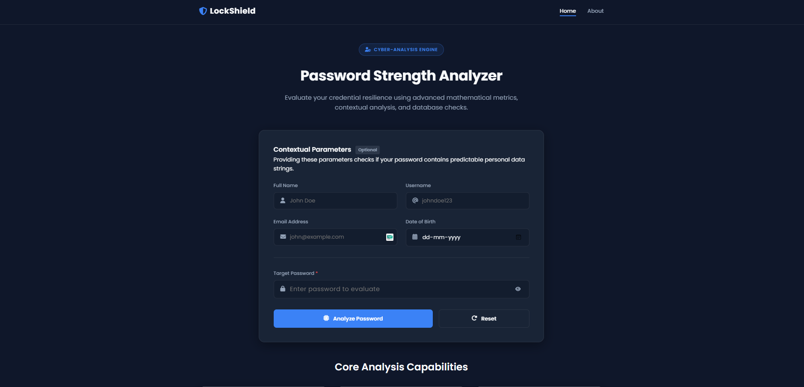
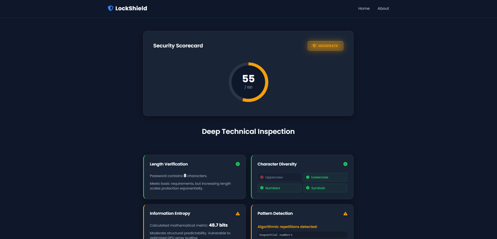
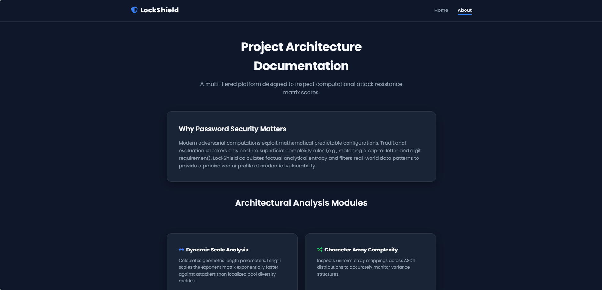

# 🛡️ LockShield - Password Strength Analyzer

A cybersecurity-focused web application built with Flask that analyzes password strength using multiple security metrics. The application evaluates passwords beyond simple length checks by calculating entropy, detecting predictable patterns, identifying personal information, checking against breached passwords, and providing actionable security recommendations.

---

## 🚀 Features

- ✅ Password Length Verification
- ✅ Character Complexity Analysis
- ✅ Password Entropy Calculation
- ✅ Pattern Detection
- ✅ Breached Password Detection
- ✅ Personal Information Detection
- ✅ Security Score (0–100)
- ✅ Password Strength Classification
- ✅ Security Recommendations
- ✅ Responsive Modern UI

---

## 🛠 Tech Stack

- Python
- Flask
- HTML5
- CSS3
- JavaScript
- Jinja2

---

## 📂 Project Structure

```text
Password-Strength-Analyzer/
│
├── analyzer/
│   ├── breach_checker.py
│   ├── complexity_checker.py
│   ├── entropy_calculator.py
│   ├── length_checker.py
│   ├── pattern_detector.py
│   ├── personal_info.py
│   ├── recommendations.py
│   └── score_calculator.py
│
├── static/
├── templates/
├── app.py
├── config.py
├── requirements.txt
└── README.md
```

---

## ⚙️ Installation

Clone the repository

```bash
git clone https://github.com/Keerthana-207/Password-Strength-Analyzer.git
```

Move into the project

```bash
cd Password-Strength-Analyzer
```

Install dependencies

```bash
pip install -r requirements.txt
```

Run the application

```bash
python app.py
```

---

## 🔍 Security Checks

The application performs:

- Password Length Analysis
- Character Diversity Check
- Entropy Calculation
- Pattern Detection
- Personal Information Detection
- Breached Password Verification
- Security Score Calculation

---

## 📸 Screenshots

<h3 align="center">Home Page</h3>

<p align="center">
  
</p>

<h3 align="center">Analysis Results</h3>

<p align="center">
  
</p>

<h3 align="center">About Page</h3>

<p align="center">
  
</p>

---

## 📈 Future Enhancements

- Have I Been Pwned API Integration
- Password Generator
- Password History Analysis
- Docker Deployment
- User Authentication
- Password Strength Visualization

---

## 👨‍💻 Author

Keerthana 

---